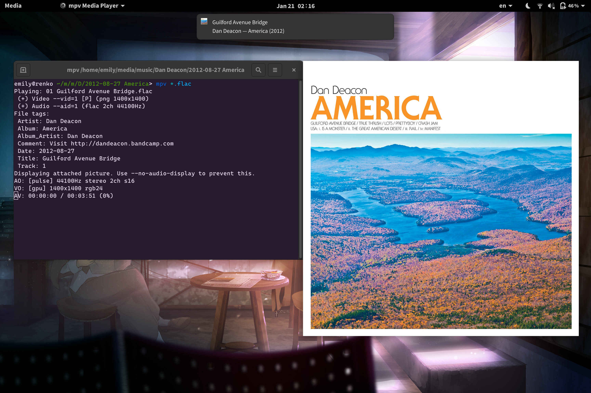

===============
mpv-notify-send
===============

This is a simple Lua script for mpv_
that sends notifications about the playing media.
It uses ``notify-send(1)`` and should therefore work
with any libnotify-compatible notifications daemon.
It reports title, album and year if available,
and shows a cover image if present
in the same directory as the media file
(filename must be ``cover.{png,jpg,jpeg}``,
and embedded images aren’t currently supported).

.. _mpv: https://mpv.io/

Usage
=====

Either copy/link ``notify-send.lua`` into
``$XDG_CONFIG_HOME/mpv/scripts``,
or set ``script=/path/to/notify-send.lua`` in ``mpv.conf``
or on the command line.

Screenshot
==========

      A screenshot of GNOME displaying a notification
      with title “Guilford Avenue Bridge”
      and body “Dan Deacon — America (2012)”
      as mpv plays the corresponding track.
    :width: 1125
    :height: 750

Licence
=======

mpv-notify-send is licensed under the WTFPL_.

.. _WTFPL: COPYING.txt
